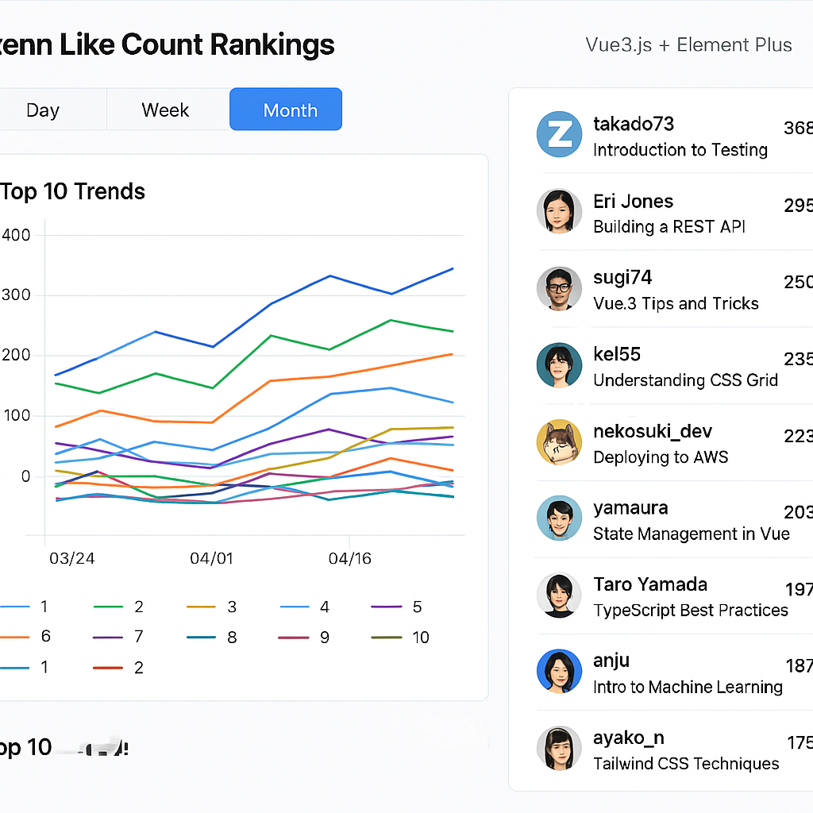

# Zenn API を利用したランキング

## 概要

- 非公式の Zenn API を利用して、集計単位を日、週、月単位で「いいね」のカウント数を元にランキングを生成する。

## 機能

- Zenn の「いいね」数を元にランキングを生成する。
- ランキングの集計単位は日、週、月単位で選択できる。
- 日の場合は 1 週間、週の場合は 4 週間、月の場合は 1 年間でのランキング上位 10 位以内の推移を折れ線グラフで表示する。
- 集計対象は、その集計期間内に作成された記事を対象とする。
- 集計単位の上位 10 位までについては、ユーザー名、記事名、ユーザーアイコン画像、「いいね」数を表示する。
  - ユーザー名/ユーザーアイコンを選択すると、ユーザーの詳細ページに遷移する。
  - 記事名を選択すると、記事の詳細ページに遷移する。
- 日本時間 01:00 に Zenn API を利用して記事情報を収集し、S3 上に配置する。その後、分析を行った結果を DyamoDB に格納する。
- 認証機能は搭載しない

## 利用環境

- 日本語のみをサポートする。多言語対応は行わない。
- PC のみ。モバイル機器等は考慮しない。

## 構築環境

- AWS 上にサーバーレスアークテクチャで構築する。
- Web アプリの提供は S3 に配置された SPA を CloudFront で配信する。
- フロントエンドで利用する API の提供は、API Gateway と Lambda を利用する。

## 画面イメージ

## 画面構成

- トップページ
  - タブ
    - 記事ランキングページ
    - About ページ

### トップページ

記事ランキングページと About ページをタブで切り替える。
デフォルトの表示は記事ランキングページ。

- タブ
  - Ranking: 記事ランキングページに遷移
  - About: About ページに遷移

### 記事ランキングページ

記事のラインキング推移を表示する。

- タブ
  - daily
  - weekly
  - monthly
- 折れ線グラフ
  - 縦軸
    - いいね数
  - 横軸
    - daily: 日単位 (2025/4/27, 2025/4/28, ...)
    - weekly: 週単位 (2025/4/14, 2025/4/21 ...)
    - monthly: 月単位 (2025/4, 2025/5, ...)
- ランキング
  - いいね順にソートされた記事と著者情報の一覧を表示する。
    - ユーザーアイコン
    - ユーザー名
    - 記事タイトル
    - いいね数
    - コメント数
